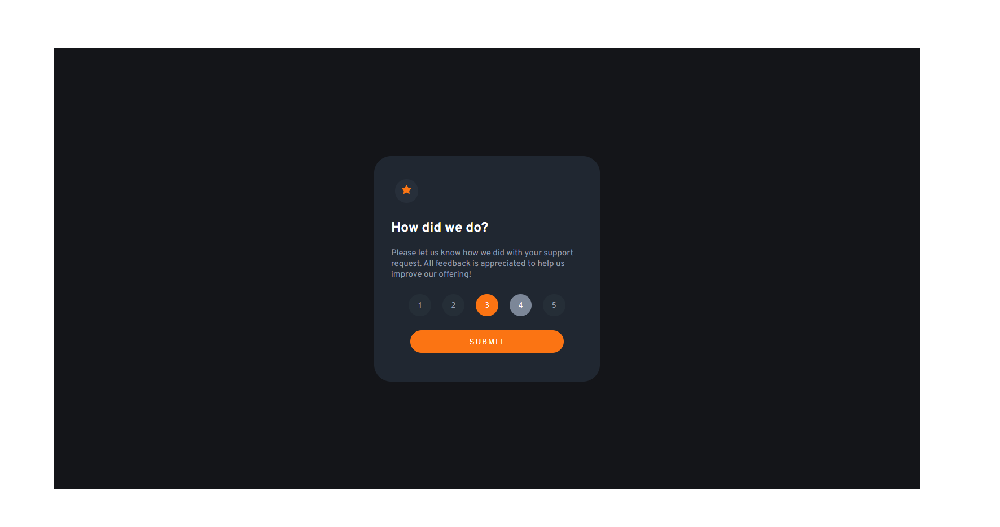
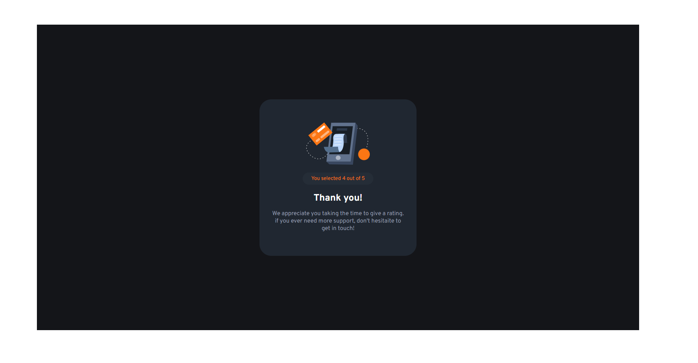

# Frontend Mentor - Interactive-Rating-Component solution

This is a solution to the [Interactive-Rating-Component](https://www.frontendmentor.io/challenges/interactive-rating-component-koxpeBUmI). Frontend Mentor challenges help you improve your coding skills by building realistic projects. 

## Table of contents

- [Overview](#overview)
- [Screenshot](#screenshot)
- [Links](#links)
  - [Author](#author)

## Overview
  Hello there!
  thanks for visiting my profile!
  If you have any thoughts, questions, or suggestions, I would love to hear from you!

## Screenshots

## Links

  <!-- - [Solution URL](https://github.com/ManolyaTam/QR-Code-Component)
  - [Live Site URL](https://manolyatam.github.io/QR-Code-Component/) -->

### Author
  - Email - [Manolya Tamimi](tamimimanolya@gmail.com)
  - GitHub - [ManolyaTam](https://github.com/ManolyaTam/)
  - Frontend Mentor - [@ManolyaTam](https://www.frontendmentor.io/profile/ManolyaTam)
